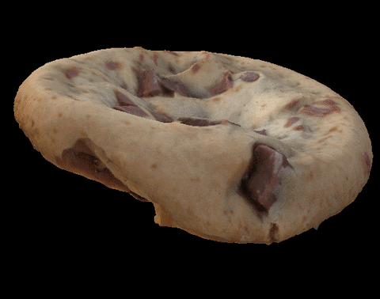

```{r setup, include=FALSE}
knitr::opts_chunk$set(echo = FALSE)
library(knitr)
library(ggplot2)
library(png)

```


```{r images, include=TRUE}



knitr::include_graphics("img/bus.png")

```

Distill is a publication format for scientific and technical writing, native to the web. 

Learn more about using Distill for R Markdown at <https://rstudio.github.io/distill>.


